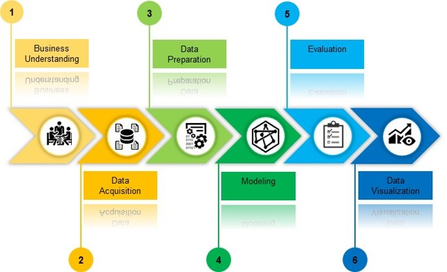
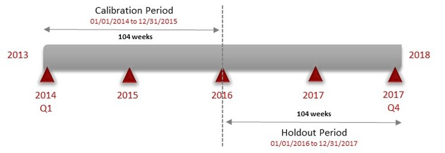

<center></center>


```{r knitr_init, echo=FALSE, results="asis", cache=FALSE, warning = FALSE, message=FALSE}
library(readxl)
library(ExPanDaR)
library(ggplot2)
library(knitr)
library(rmdformats)
library(DT)
library(DataExplorer)
library(dplyr)
library(lubridate)
library(VIM)
library(BTYD)
library(BTYDplus)


## Global options
options(max.print = "75")
opts_chunk$set(echo = FALSE,
	             cache = FALSE,
               prompt = FALSE,
               tidy = FALSE,
               comment = NA,
               message = FALSE,
               warning = FALSE)
opts_knit$set(width = 75)
```

# Introduction
 
Customer Lifetime Value (CLV) is a metric to estimate the value (profit) that a relationship with a customer represents for a business during a specific period of time. Some of the benefits of CLV are **Better Marketing, Encourage Brand Loyalty, and Gain More Sales.**

The goal of this project is to estimate the **Customer Lifetime Value (CLV)** that can enable the organization to implement future actions to maximize it.

For this implementation, we will use a **Buy Till You Die** (BTYD) model given by a **R package** with the same name: BTYD.

```{r sh, echo=TRUE, eval=TRUE, warning = FALSE, message=FALSE}

not_null <- function (v) {
  if (!is.null(v)) return(paste(v, "not null"))
}
data(iris)
tab <- iris %>%
  group_by(Species) %>%
  summarise(Sepal.Length = mean(Sepal.Length),
            Sepal.Width  = mean(Sepal.Width),
            Petal.Length = mean(Petal.Length),
            Petal.Width  = mean(Petal.Length))
```


## Roadmap

Here are **the stages** to be followed by this project.

<center></center>

```{r iris_str, echo=TRUE}
# Here is the structure of the `iris` dataset.

# str(iris)
```

<!-- And blockquote : -->

<!-- > Oh ! What a nice blockquote you have here. Much more wonderful than a classical Lorem Ipsum, really. -->
<!-- And we could also [include links](https://github.com/juba/rmdformats) or simply URLs like this : https://github.com/juba/rmdformats -->

# Business Understanding


Global Superstore is a fictitious retailer company doing business in several countries having presence on every continent. The dataset from this company was created and made available by Tableau. 
The idea behind this is to analyze the transactional data in order to learn spending habits related to sales by regions, segments, product categories, etc. Additionally, segmentation and forecasting models can be performed among other kind of analysis.

Global Superstore records commercial transactions information in detail, in particular **ORDERS** data, Thus, we will be able to examine the value of the customers over time to gain insights that can benefit the organization allowing make more data-driven decisions.


# Data Acquisition

We will use The Global Superstore dataset that contains information about products, sales, profits, and so on; data that can generate rich information to identify actionable insights or key areas for improvement within this company.


The dataset has information of around 50k orders from 2014 to 2017 made at multiple markets worldwide. 


[Click here to access the dataset.](https://community.tableau.com/thread/278494){target="_blank"}

Loading  **order datasets...**.

Here is a **sample** of the order datasets.

```{r loading1, echo=TRUE,eval=TRUE , warning = FALSE, message=FALSE}

# Reading the dataset

data.order <- data.frame(read_excel("Global Superstore 2018.xlsx", sheet="Orders"))

data.order$Order.Year <- substr(data.order$Order.Date, 1,4) 

datatable(data.order[(1:20),], filter = 'top', options = list(
  pageLength = 5, scrollX = TRUE, scrollY = "200px", autoWidth = TRUE), caption = 'Table 1: Orders dataset.')

```

Checking **missing values...**

```{r loading2, echo=TRUE,fig.height=6, fig.cap ="Missing Values Review" , eval=TRUE , warning = FALSE, message=FALSE}


prepare_missing_values_graph(data.order, ts_id = "Order.Year") + scale_fill_gradient(low="black", high="darkred")

```

We can notice that only **Postal Code** has **missing values**. So no big issues with the data since we need mainly the columns: order date, customer id, and sales. These columns will be the pillars for our CLV model.

```{r iris_pilltabs, results="asis"}


# An incredibly complex equation :
# 
# $$ y = \sqrt{\frac{1}{x}} $$
# 
# kable(tab)

# 
# Here we display a crosstab displayed in several different ways with a "pills"
# interface. To do this, just pass your `table()` result to the `pilltabs()`
# function.
# iris$seplc <- cut(iris$Sepal.Length,3)
# tab <- table(iris$Species, iris$seplc)
# pilltabs(tab)
```

# Data Preparation

As next step, we will group the data (order lines) and put the transaction date in a correct format.
Then, we will present a complete transaction records of 30 customers.

```{r Preparation, fig.height=6, fig.cap ="" , eval=TRUE , warning = FALSE, message=FALSE}

#Removing columns
data.order.sum  <- subset(data.order, select = c('Order.ID','Customer.ID','Order.Date','Sales'))

#Grouping to calculate total order
data.order.sum <- subset(data.order.sum,select = c(Order.ID, Customer.ID,Order.Date, Sales)) %>% group_by(Order.ID, Customer.ID,Order.Date) %>% summarise(Sales=sum(Sales))

data.order.sum$Order.ID <- NULL
data.order.sum$Order.Date <- as.Date(data.order.sum$Order.Date,"%Y/%m/%d");
colnames(data.order.sum) <- c('cust','date','sales')

elog <- data.order.sum


range(elog$date)

set.seed(123)
# plot timing patterns of 30 sampled customers
plotTimingPatterns(elog, n = 30, T.cal = "2015-12-31",T.tot = "2017-12-31", headers = c("Past", "Future"), title = "Plot Timing Patterns Of Sampled Customers")


```

#Data Modeling

We will implement a BG/NBD model that is used for non-contractual situations in which customers can make purchases at any time. 

[Click here to access the research paper.](http://brucehardie.com/papers/018/fader_et_al_mksc_05.pdf){target="_blank"}

```{r Modeling1, echo=TRUE,fig.height=6, fig.cap ="" , eval=TRUE , warning = FALSE, message=FALSE}

print('Checking a sample of the final data structure.')
elog$date <- as.Date(elog$date, "%Y%m%d");

elog[1:3,]


```

Merging all transactions that occurred on the **same day.**
Transaction-flow models, such as the BG/NBD, is concerned with interpurchase time.
```{r Modeling2, fig.height=6, fig.cap ="" , eval=TRUE , warning = FALSE, message=FALSE}

#elog <- dc.MergeTransactionsOnSameDate(elog)

```

Dividing the data up into a calibration period and a holdout period.
We will use **December 31, 2015** as the cutoff date, so 104 weeks are dividing the dataset in half.

<center></center>


```{r Modeling3, echo=TRUE,fig.height=6, fig.cap ="" , eval=TRUE , warning = FALSE, message=FALSE}

end.of.cal.period <- as.Date("2015-12-31")
elog.cal <- elog[which(elog$date <= end.of.cal.period), ]

split.data <- dc.SplitUpElogForRepeatTrans(elog.cal);
clean.elog <- split.data$repeat.trans.elog;

```

The next step is to create a **customer-by-time matrix**. This is simply a matrix with a row for each customer and a column for each date. 

```{r Modeling4, fig.height=6, fig.cap ="" , eval=TRUE , warning = FALSE, message=FALSE}

freq.cbt <- dc.CreateFreqCBT(clean.elog);
freq.cbt[22:26,1:6]

```


```{r Modeling5, fig.height=6, fig.cap ="" , eval=TRUE , warning = FALSE, message=FALSE}


tot.cbt <- dc.CreateFreqCBT(elog.cal)
#tot.cbt <- dc.CreateFreqCBT(elog)
cal.cbt <- dc.MergeCustomers(tot.cbt, freq.cbt)

birth.periods <- split.data$cust.data$birth.per
last.dates <- split.data$cust.data$last.date
cal.cbs.dates <- data.frame(birth.periods, last.dates, end.of.cal.period)
cal.cbs <- dc.BuildCBSFromCBTAndDates(cal.cbt,  cal.cbs.dates, per="week")
   

params <- bgnbd.EstimateParameters(cal.cbs)
params

LL <- bgnbd.cbs.LL(params, cal.cbs)
LL

p.matrix <- c(params, LL)
for (i in 1:2){
params <- bgnbd.EstimateParameters(cal.cbs, params)
LL <- bgnbd.cbs.LL(params, cal.cbs)
p.matrix.row <- c(params, LL)
p.matrix <- rbind(p.matrix, p.matrix.row)
}
colnames(p.matrix) <- c("r", "alpha", "a", "b", "LL")
rownames(p.matrix) <- 1:3
p.matrix

bgnbd.PlotTransactionRateHeterogeneity(params)

bgnbd.PlotDropoutRateHeterogeneity(params)

                           
```

# Evaluation

Making estimations for customers on the individual level.

```{r Modeling6, fig.height=6, fig.cap ="" , eval=TRUE , warning = FALSE, message=FALSE}

print('Customer: AA-10315102')

bgnbd.Expectation(params, t=52)

cal.cbs["AA-10315102",]

x <- cal.cbs["AA-10315102", "x"]
t.x <- cal.cbs["AA-10315102", "t.x"]
T.cal <- cal.cbs["AA-10315102", "T.cal"]
bgnbd.ConditionalExpectedTransactions(params, T.star = 52,x, t.x, T.cal)

bgnbd.PAlive(params, x, t.x, T.cal)


for (i in seq(10, 25, 5)){
cond.expectation <- bgnbd.ConditionalExpectedTransactions(
params, T.star = 52, x = i,t.x = 20, T.cal = 39)
cat ("x:",i,"\t Expectation:",cond.expectation, fill = TRUE)
}

bgnbd.PlotFrequencyInCalibration(params, cal.cbs, 5)


elog <- dc.SplitUpElogForRepeatTrans(elog)$repeat.trans.elog;
x.star <- rep(0, nrow(cal.cbs));
cal.cbs <- cbind(cal.cbs, x.star);
elog.custs <- elog$cust;
for (i in 1:nrow(cal.cbs)){
current.cust <- rownames(cal.cbs)[i]
tot.cust.trans <- length(which(elog.custs == current.cust))
cal.trans <- cal.cbs[i, "x"]
cal.cbs[i, "x.star"] <- tot.cust.trans - cal.trans
}
cal.cbs[1:3,]


T.star <- 104 # length of the holdout period
censor <- 5 # This censor serves the same purpose described above
x.star <- cal.cbs[,"x.star"]
comp <- bgnbd.PlotFreqVsConditionalExpectedFrequency(params, T.star,cal.cbs, x.star, censor)

rownames(comp) <- c("act", "exp", "bin")
comp


tot.cbt <- dc.CreateFreqCBT(elog)
# ...Completed Freq CBT
d.track.data <- rep(0, 7 * 208)
origin <- as.Date("2014-01-01")
for (i in colnames(tot.cbt)){
date.index <- difftime(as.Date(i), origin) + 1
d.track.data[date.index] <- sum(tot.cbt[,i])
}
w.track.data <- rep(0, 208)
for (j in 1:208){
w.track.data[j] <- sum(d.track.data[(j*7-6):(j*7)])
}


T.cal <- cal.cbs[,"T.cal"]
T.tot <- 208
n.periods.final <- 208
inc.tracking <- bgnbd.PlotTrackingInc(params, T.cal,T.tot, w.track.data,n.periods.final)
inc.tracking[,20:25]


cum.tracking.data <- cumsum(w.track.data)
cum.tracking <- bgnbd.PlotTrackingCum(params, T.cal,T.tot, cum.tracking.data,n.periods.final)
cum.tracking[,20:25]

```